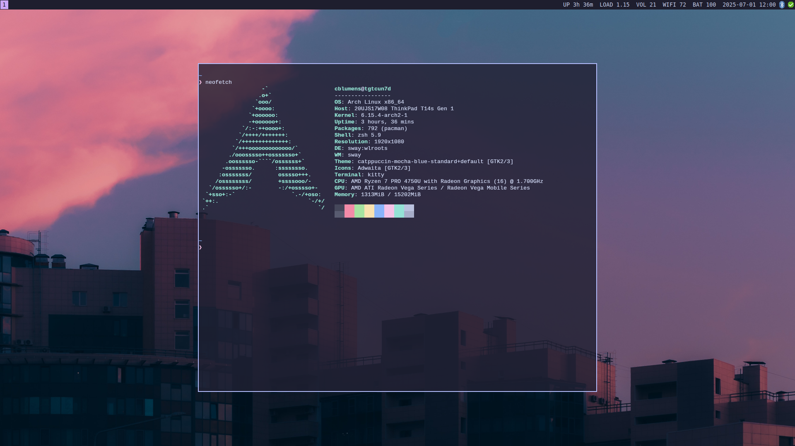

# ⚡ Complete CLI Security & Productivity Stack
**GPG-encrypted passwords. Terminal-based everything. Battle-tested for years.**

## Why This Setup?
Tired of waiting for Electron apps to load? Want your entire workflow to run over SSH? This is a complete terminal-based productivity system that actually works.

## The Stack
- **OS:** Arch Linux (rolling release)
- **WM:** sway (wayland tiling)
- **Browser:** qutebrowser
- **Terminal:** foot (wayland native)
- **Passwords:** pass (GPG)
- **Mail:** offlineimap + neomutt 
- **Calendar:** vdirsyncer + khal
- **Contacts:** vdirsyncer + khard
- **Tasks:** todoman
- **Browser:** qutebrowser
- **Editor:** nvim
- **PDF:** zathura


*Wallpaper: [Catppuccin Evening Sky](https://github.com/zhichaoh/catppuccin-wallpapers/blob/main/landscapes/evening-sky.png)*

## What You Get
- **Zero GUI dependencies** - runs over SSH
- **Complete offline capability** - airplane mode ready
- **Sync everywhere** - phone, laptop, server
- **Lightning fast** - no bloated clients
- **Highly scriptable** - automate everything
- **Privacy-focused** - all credentials GPG-encrypted

## Security Model
All passwords are GPG-encrypted via `pass`. No plaintext credentials anywhere:

```bash
# offlineimap pulls passwords from pass
passwordeval = pass show email/work/password

# vdirsyncer uses pass for credentials
password.fetch = ["command", "pass", "show", "caldav/nextcloud"]
```

## Perfect For
- Developers who live in terminal
- Privacy-conscious users
- People tired of resource-heavy apps
- Anyone who values speed over shininess
- Remote workers who need SSH-friendly tools

## Quick Start
```bash
git clone https://github.com/yourusername/dotfiles
cd dotfiles
# Look around and use what you find interesting
```

## Not Included
- Fancy animations
- Experimental features that break weekly
- Configs that need constant maintenance

---

*"Why click when you can type?"*

**⭐ Star if this setup inspires your workflow**
