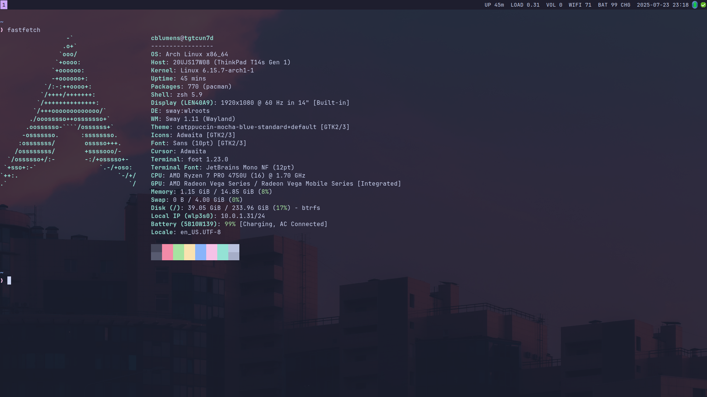

# ⚡ **EXTREME CLI MASTERY** - The Terminal-Only Lifestyle
**🔥 Battle-tested for YEARS. Zero compromises. Maximum productivity.**

## 🚀 **Why This Exists**
Most people are **SLAVES** to their GUI apps. You're about to break free.

This isn't just a config collection - **it's a complete philosophy.**

## 💀 **The Complete Arsenal**
- **OS:** Arch Linux (rolling release) - because stability is for the weak
- **Passwords:** pass (GPG + git sync) - your secrets stay SECRET
- **Mail:** mutt/neomutt + offlineimap - email like a HACKER
- **Calendar:** vdirsyncer + khal - meetings without bloat
- **Contacts:** vdirsyncer + khard - relationships, optimized
- **Tasks:** todoman - GTD without the GUI addiction
- **Browser:** qutebrowser - vim keys EVERYWHERE
- **Editor:** nvim (Lua config) - coding at light speed
- **WM:** sway (Wayland tiling) - windows that OBEY you
- **PDF:** zathura - documents without distractions



## 🎯 **What You Actually Get**

### **🔓 FREEDOM**
- **Zero GUI dependencies** - works over potato connections
- **Complete offline capability** - internet? optional.
- **Sync everywhere** - phone, laptop, toaster
- **Lightning fast** - because RAM is precious
- **Infinitely scriptable** - automate your life away

### **🛡️ SECURITY THAT MATTERS**
- **All passwords GPG-encrypted** (pass store)
- **No plaintext credentials** ANYWHERE
- **Audit every line** - no mystery meat code

### **⚡ SPEED THAT HURTS**
```bash
# While others wait for Outlook to load...
mutt # <- you're already reading email

# While they click through calendar apps...
khal list today # <- your day is planned

# While they fumble with password managers...
pass -c work/email # <- copied to clipboard
```

## 🔥 **Integration Magic**
```bash
# offlineimap pulls passwords from pass - SEAMLESS
passwordeval = pass show email/work/password

# vdirsyncer uses pass for credentials - NO HARDCODING
password.fetch = ["command", "pass", "show", "caldav/nextcloud"]

# Everything talks to everything - ECOSYSTEM
```

## 🎯 **Perfect For**
- **Developers** who think GUIs are training wheels
- **Privacy warriors** who don't trust Big Tech
- **Speed demons** tired of waiting for Electron
- **Minimalists** who know less is more
- **Power users** who want COMPLETE control

## ❌ **NOT Included (Intentionally)**
- Fancy animations that waste CPU
- RGB that screams "look at me"
- Experimental features that break weekly
- Configs maintained by weekend warriors

## 🚀 **Ready to Ascend?**

**Clone this. Use this. BECOME this.**

Your future productive self will thank you.

---

*"Why click when you can command?"* 

**⭐ Star if this saves you from GUI hell**

**🍴 Fork if you're ready to join the terminal elite**

**📢 Share if you want to convert the masses**

---
**Warning:** *May cause severe productivity increases and terminal addiction.*
